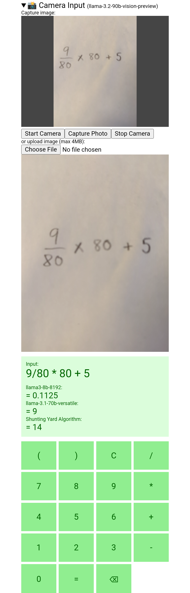

# LLMCalculator

Calculator powered by LLMs.


### Audio Input

### Image Input


## Architecture
No credit card stack:
- Next.js app deployed on Vercel (free tier)
- Groq to query LLM models (free tier limits 15-30 requests/min depending on model) 
- Discord for logging


## Local development
Create a `.env.local` file with the following:
```
GROQ_API_KEY=<YOUR_GROQ_API_KEY>
DISCORD_CHANNEL_ID=<YOUR_DISCORD_CHANNEL_ID>
DISCORD_BOT_TOKEN=<YOUR_DISCORD_BOT_TOKEN>
```

Run the development server:
```bash
npm run dev
# or
yarn dev
# or
pnpm dev
# or
bun dev
```

Open [http://localhost:3000](http://localhost:3000) with your browser to see the result.
